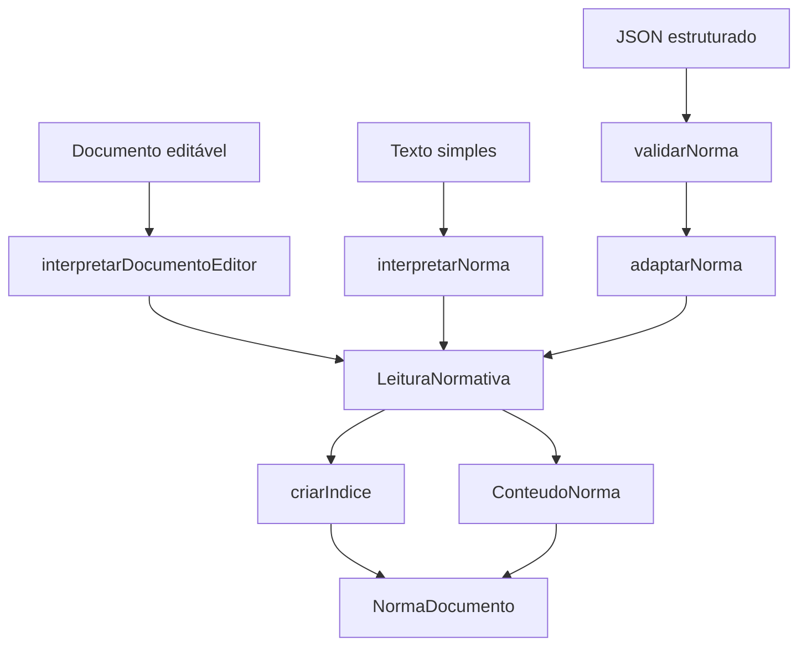

# Como a norma vira um documento na tela

Este guia descreve o código deste repositório. Comece pelas seções 1–3 para entender o conjunto; as demais detalham as regras e os campos. Os exemplos são didáticos e fictícios.

## 1. Existem três caminhos de entrada

**Texto simples:** `interpretarNorma(texto)` tenta reconhecer o início de cada linha e produz uma lista de blocos. É usado em `/leitor` e na leitura dos exemplos antigos que ainda não têm estrutura salva.

**Editor contínuo:** `interpretarDocumentoEditor(documento)` recebe o JSON editável, preserva classificações manuais e formatação e deriva os blocos com IDs estáveis. É o caminho dos novos cadastros. O algoritmo completo, os campos persistidos, os vazios e as tabelas estão em [Editor contínuo](editor-continuo.md).

**JSON estruturado:** `validarNorma(json)` verifica a estrutura suportada; `adaptarNorma(documento)` percorre a árvore já informada e produz a leitura. É usado na resolução importada e na edição de documentos que já vieram estruturados. Aqui, capítulo, seção, artigo e seus filhos já estão identificados no JSON. Não se aplicam expressões regulares para reconstruí-los.



Arquivos principais:

| Arquivo em `src/app/shared/normas/` | Responsabilidade                                                  |
| ----------------------------------- | ----------------------------------------------------------------- |
| `documento-editor.ts` | Reconhecimento e projeção do editor contínuo. |
| `parser-norma.ts`                   | Reconhecer dispositivos no texto simples.                         |
| `conteudo-norma.ts`                 | Contrato da árvore recebida em JSON.                              |
| `norma.ts`                          | Identificação, fontes, publicações, extração e modelo de leitura. |
| `validar-norma.ts`                  | Conferir a estrutura JSON suportada.                              |
| `adaptar-norma.ts`                  | Converter a árvore em blocos para apresentação.                   |
| `bloco-normativo.ts`                | Contrato desses blocos e da leitura.                              |
| `indice-norma.ts`                   | Construir o índice de agrupamentos e artigos.                     |
| `acervo.ts`                         | Acervo em memória e operações do mock.                            |

O extrator HTML/Python que produziu o JSON original **não está neste repositório**. Portanto, este guia não atribui suas regras ao parser TypeScript: esse caminho recebe o JSON pronto. A colagem HTML do editor contínuo tem seu próprio normalizador; não é o extrator que produziu a resolução importada.

## 2. O que deve ser informado antes do conteúdo

No novo cadastro, a sequência é **informações principais → editor com pré-visualização → salvar no mock**. Os campos principais não são extraídos dos artigos.

A separação é:

| Camada                 | Exemplo                                                                       | Função                                                                      |
| ---------------------- | ----------------------------------------------------------------------------- | --------------------------------------------------------------------------- |
| Identificação da norma | Órgão, espécie, número, ano, data do ato, epígrafe e ementa                   | Identificar o documento inteiro.                                            |
| Situação               | `nao_verificada`, `vigente`, `revogada`                                       | Situação informada explicitamente; não calculada pelo parser.               |
| Publicações e fontes   | Veículo, data, URL, `fonteId`                                                 | Registrar a origem e onde houve publicação.                                 |
| Extração               | Método, data, observações, hash opcional                                      | Registrar como o material de origem foi obtido.                             |
| Conteúdo               | Capítulos, seções, artigos, parágrafos, textos, tabelas, assinaturas e anexos | Representar o documento em ordem de leitura.                                |
| Apresentação           | Alinhamento e dimensões opcionais                                             | Orientar os componentes visuais nos pontos que suportam essas propriedades. |

**Preâmbulo:** no JSON atual, é um nó `texto` no início de `conteudo`; não há um campo `identificacao.preambulo`. Nos exemplos antigos de texto simples, `NormaLeitura.preambulo` existe separado e aparece antes dos dispositivos. No editor contínuo, o usuário pode classificar um ou mais parágrafos como `preambulo` no corpo; exemplos antigos continuam com o campo separado. Documentos JSON importados mantêm seu nó inicial.

**Assinaturas:** no JSON são partes de categoria `assinatura`, na posição em que aparecem no array. No modelo antigo também podem ser fornecidas no array `NormaLeitura.assinaturas`, exibido após o corpo. No editor contínuo, o usuário pode classificar o trecho como `assinatura`; não há inferência automática de quem assina. Não preencher dois caminhos para a mesma assinatura.

## 3. O JSON é uma árvore; a leitura é uma lista

Cada nó `parte` possui seu próprio array `conteudo`. **Estar dentro desse array significa pertencer àquela parte.** O array também define a ordem entre irmãos. Não é necessário um campo `ordem`.

```json
{
  "id": "capitulo-1",
  "tipo": "parte",
  "categoria": "capitulo",
  "rotulo": "CAPÍTULO I",
  "titulo": "DISPOSIÇÕES GERAIS",
  "conteudo": [
    {
      "id": "secao-1",
      "tipo": "parte",
      "categoria": "secao",
      "rotulo": "Seção I",
      "titulo": "Do cadastro",
      "conteudo": [
        {
          "id": "art-1",
          "tipo": "parte",
          "categoria": "artigo",
          "rotulo": "Art. 1º",
          "numero": "1",
          "conteudo": [
            {
              "id": "caput-1",
              "tipo": "texto",
              "trechos": [{ "texto": "O cadastro observará estas regras." }]
            },
            {
              "id": "par-1",
              "tipo": "parte",
              "categoria": "paragrafo",
              "rotulo": "Parágrafo único.",
              "conteudo": [
                {
                  "id": "texto-par-1",
                  "tipo": "texto",
                  "trechos": [{ "texto": "Os dados serão conferidos." }]
                }
              ]
            }
          ]
        }
      ]
    }
  ]
}
```

Nesse exemplo, o capítulo contém a seção; a seção contém o artigo; o artigo contém o caput e o parágrafo. Ao adaptar para renderização:

| ID do bloco  | `tipo` de leitura | `paiId`      | `profundidade` | Texto principal                     |
| ------------ | ----------------- | ------------ | -------------: | ----------------------------------- |
| `capitulo-1` | `agrupamento`     | `null`       |              0 | CAPÍTULO I; título em campo próprio |
| `secao-1`    | `agrupamento`     | `capitulo-1` |              0 | Seção I; título em campo próprio    |
| `art-1`      | `artigo`          | `secao-1`    |              0 | O cadastro observará estas regras.  |
| `par-1`      | `paragrafo`       | `art-1`      |              1 | Os dados serão conferidos.          |

O primeiro nó `texto` de um dispositivo é incorporado ao bloco do próprio dispositivo. Por isso `caput-1` e `texto-par-1` não viram blocos independentes na leitura. Seus IDs continuam no JSON de origem. **A lista de leitura não deve ser usada para reconstruir o documento original ou substituir seu armazenamento.**

`profundidade` é o recuo visual, não a distância absoluta à raiz. Um artigo dentro de capítulo e seção continua com profundidade 0. A relação estrutural é registrada por `paiId`.

## 4. Parser de texto simples: algoritmo completo

Assinatura: `interpretarNorma(original: string): LeituraNormativa`.

### 4.1 Preparação das linhas

1. Divide a entrada por `CRLF`, `LF` ou `CR`: `original.split(/\r\n|\n|\r/)`.
2. Mantém a entrada inteira em `leitura.original`.
3. Usa `linhaOriginal.trim()` somente para reconhecimento.
4. Pula linhas vazias. Elas continuam no original e contam na numeração das linhas, mas não viram blocos.
5. Define o ID como `linha-N`, sendo N a posição original, começando em 1.
6. Começa cada bloco com `tipo: 'texto'`, rótulo vazio, texto original, profundidade 0 e nenhum pai.

Consequência: inserir uma linha no início muda os IDs seguintes. Esses IDs servem para navegação da leitura, **não são IDs permanentes de dispositivos**.

### 4.2 Citações são verificadas antes dos dispositivos

Se a linha aparada começa com `“` ou `"`, abre uma citação. O fechamento esperado é, respectivamente, `”` ou `"`.

- A linha de abertura, as intermediárias e a linha de fechamento ficam como `texto`.
- A linha inteira de fechamento permanece texto, mesmo que contenha algo depois das aspas.
- Se abre e fecha na mesma linha, somente essa linha fica protegida.
- Uma nova abertura gera o aviso de citação preservada para revisão.
- Aspas de abertura no meio de uma linha, aspas simples e `« »` não iniciam esse mecanismo.
- Não há tratamento de aspas aninhadas ou escapes; o fechamento é procurado por `includes`.
- Sem fechamento, o restante permanece na citação; não existe um segundo aviso específico de aspas não fechadas.
- A citação não apaga o último artigo/parágrafo reconhecido. Depois de fechá-la, o contexto anterior pode continuar.

### 4.3 Anexos interrompem o reconhecimento estrutural

Fora de citação, uma linha que começa com `ANEXO` seguido de espaço ou fim de linha ativa `emAnexo`.

O parser apaga os superiores ativos, emite aviso e conserva **o cabeçalho e todo o restante** como texto. Não tenta entender tabelas nem artigos do anexo. Não existe comando de retorno ao corpo principal: `emAnexo` permanece ativo até o final da entrada. Um novo cabeçalho `ANEXO` pode gerar outro aviso.

Isso é diferente do JSON: nele anexos, artigos e tabelas podem estar explicitamente estruturados.

### 4.4 Reconhecimento de agrupamentos

Fora de citação/anexo, testa:

```ts
/^(?:PARTE|LIVRO|TÍTULO|CAPÍTULO|SEÇÃO|SUBSEÇÃO)\s+\S+/i;
```

A linha deve começar com um dos nomes, seguido de espaço e algum conteúdo. A comparação ignora maiúsculas/minúsculas, mas o regex exige os acentos escritos nele (`CAPITULO` não é igual a `CAPÍTULO`). Não valida o numeral.

Ao reconhecer:

- produz `tipo: 'agrupamento'`;
- mantém a linha inteira em `texto` e `original`, sem separar rótulo e título;
- apaga artigo, parágrafo, inciso e alínea ativos;
- ativa `esperaTitulo`.

A próxima linha elegível não reconhecida como dispositivo ou novo agrupamento vira `tipo: 'titulo'`. Linhas vazias não consomem a espera. Linhas protegidas como citação/anexo não passam por esse teste. Não há exame do conteúdo para comprovar que a linha é realmente um título.

Exemplo: `CAPÍTULO I` + `DISPOSIÇÕES GERAIS` gera dois blocos. `CAPÍTULO I DISPOSIÇÕES GERAIS` gera um agrupamento com tudo na mesma linha; não divide esse texto internamente.

### 4.5 Reconhecimento dos dispositivos

Na ausência de agrupamento, os padrões são testados **nesta ordem**. O primeiro que corresponder vence:

```ts
const PADROES = [
  ['artigo', /^(Art\.\s*\d+(?:[º°o])?(?:-[A-Z]+)?\.?)(?:\s+|$)(.*)$/i],
  ['paragrafo', /^(Parágrafo único\.?|§\s*\d+(?:[º°o])?(?:-[A-Z]+)?\.?)(?:\s+|$)(.*)$/i],
  ['inciso', /^([IVXLCDM]+\s*[-–—])\s*(.*)$/],
  ['alinea', /^([a-z]\))\s*(.*)$/],
  ['item', /^(\d+\.)\s+(.*)$/],
];
```

| Tipo      | Exemplos reconhecidos                                 | Observação                                                                                            |
| --------- | ----------------------------------------------------- | ----------------------------------------------------------------------------------------------------- |
| Artigo    | `Art. 1º Texto`, `Art. 10. Texto`, `Art. 10-A. Texto` | Exige `Art.`; aceita ordinal e sufixo. Não reconhece a palavra `Artigo` por extenso.                  |
| Parágrafo | `Parágrafo único. Texto`, `§ 1º Texto`, `§ 10. Texto` | O nome por extenso reconhecido é `Parágrafo único`, com acento.                                       |
| Inciso    | `I - Texto`, `II – Texto`, `III — Texto`              | Letras romanas maiúsculas e um dos três traços. O regex não valida se o numeral romano é bem formado. |
| Alínea    | `a) texto`, `b)texto`                                 | Uma letra minúscula seguida de `)`.                                                                   |
| Item      | `1. texto`, `12. texto`                               | Algarismos + ponto + espaço. `1)` não é item; `1.` sozinho não corresponde após o `trim`.             |

Nos padrões, grupo 1 vira `rotulo` e grupo 2 vira `texto`. `original` permanece a linha recebida, inclusive espaços. As flags `i` só existem nos dois primeiros padrões; inciso e alínea têm distinção de caixa.

Não há renumeração, validação de sequência, dedução de vigência nem interpretação jurídica.

### 4.6 Como se escolhe o pai e o nível

O parser guarda quatro referências: último artigo, último parágrafo, último inciso e última alínea reconhecidos.

| Novo bloco   | Pai escolhido                               | Contexto apagado depois de criar o bloco |
| ------------ | ------------------------------------------- | ---------------------------------------- |
| Agrupamento  | Nenhum                                      | Artigo, parágrafo, inciso e alínea       |
| Artigo       | Nenhum                                      | Parágrafo, inciso e alínea               |
| Parágrafo    | Último artigo                               | Inciso e alínea                          |
| Inciso       | Último parágrafo; se ausente, último artigo | Alínea                                   |
| Alínea       | Último inciso                               | Nenhum; substitui a alínea ativa         |
| Item         | Última alínea                               | Nenhum                                   |
| Texto/título | Nenhum                                      | Nenhum                                   |

Quando existe pai: `paiId = pai.id` e `profundidade = pai.profundidade + 1`.

Se parágrafo, inciso, alínea ou item não tiver o superior exigido, o bloco volta a ser `texto`, perde o rótulo separado, mantém a linha original e gera aviso. Fica na raiz visual. Um bloco reclassificado como texto não atualiza as referências de dispositivos.

**Duas consequências importantes:**

- Um inciso depois de um parágrafo pertence ao último parágrafo ativo. O parser não consegue adivinhar que o autor pretendia retornar ao caput do artigo.
- Uma linha de continuação sem marcador vira um bloco de texto com profundidade 0 e sem pai. Ela não é concatenada ao dispositivo anterior, embora o contexto anterior continue ativo para a próxima linha reconhecida.

### 4.7 Exemplo acompanhado linha por linha

Entrada sem linhas vazias:

```text
CAPÍTULO I
DISPOSIÇÕES GERAIS
Art. 1º O cadastro observará:
I - identificação;
a) órgão emissor;
1. unidade responsável.
§ 1º A revisão compreenderá:
I - conferência dos dados.
Art. 2º Esta norma entra em vigor.
```

Resultado:

| Linha / ID    | Tipo        | Pai       | Profundidade |
| ------------- | ----------- | --------- | -----------: |
| 1 / `linha-1` | agrupamento | ausente   |            0 |
| 2 / `linha-2` | titulo      | ausente   |            0 |
| 3 / `linha-3` | artigo      | ausente   |            0 |
| 4 / `linha-4` | inciso      | `linha-3` |            1 |
| 5 / `linha-5` | alinea      | `linha-4` |            2 |
| 6 / `linha-6` | item        | `linha-5` |            3 |
| 7 / `linha-7` | paragrafo   | `linha-3` |            1 |
| 8 / `linha-8` | inciso      | `linha-7` |            2 |
| 9 / `linha-9` | artigo      | ausente   |            0 |

Um bloco concreto:

```json
{
  "id": "linha-8",
  "tipo": "inciso",
  "rotulo": "I -",
  "texto": "conferência dos dados.",
  "original": "I - conferência dos dados.",
  "linha": 8,
  "profundidade": 2,
  "paiId": "linha-7"
}
```

O agrupamento e o artigo não recebem vínculo entre si nesse parser. Esse vínculo será inferido somente pelo índice, como explicado na seção 7.

### 4.8 Retorno e avisos

```ts
interface LeituraNormativa {
  original: string;
  blocos: readonly BlocoNormativo[];
  avisos: readonly string[];
}
```

Há avisos para citação, anexo, dispositivo sem superior e, ao final, entrada não vazia sem nenhum artigo reconhecido. Texto vazio retorna arrays vazios, sem aviso. Texto livre comum não gera aviso individual.

O parser em si não impõe tamanho máximo. O limite de 200.000 caracteres pertence às interfaces de leitura e edição. No editor contínuo, uma colagem maior é mantida integralmente, mas não é interpretada nem salva até sua correção. O parser `interpretarNorma` trata HTML como texto literal; a colagem formatada usa outro caminho, descrito no guia do editor contínuo.

## 5. Contrato do JSON estruturado

### 5.1 Raiz e identificação

| Campo                    | Tipo / preenchimento                    | Uso                                                                  |
| ------------------------ | --------------------------------------- | -------------------------------------------------------------------- |
| `versaoSchema`           | string; validador aceita `1.0.0`        | Seleciona o formato suportado.                                       |
| `id`                     | string única no documento               | Identidade da norma, rota e prefixo dos elementos.                   |
| `tipo`                   | `norma`                                 | Identifica o documento raiz.                                         |
| `identificacao.orgao`    | string                                  | Órgão emissor.                                                       |
| `identificacao.especie`  | `CategoriaNorma`                        | Categoria da busca e da leitura.                                     |
| `identificacao.numero`   | string                                  | Número catalogado; não é convertido para número inteiro.             |
| `identificacao.ano`      | inteiro                                 | Ano catalogado.                                                      |
| `identificacao.dataAto`  | string de data                          | Data do ato; não substitui publicação.                               |
| `identificacao.epigrafe` | string                                  | Cabeçalho exibido na leitura.                                        |
| `identificacao.titulo`   | string                                  | Título descritivo da norma; não é título de capítulo.                |
| `identificacao.ementa`   | string                                  | Ementa exibida na leitura e pesquisada na consulta.                  |
| `identificacao.processo` | string opcional                         | Número do processo.                                                  |
| `situacao`               | `vigente`, `revogada`, `nao_verificada` | Situação informada pelo responsável.                                 |
| `fontes`                 | array, pode estar vazio                 | Fontes conhecidas.                                                   |
| `publicacoes`            | array, pode estar vazio                 | Publicações conhecidas; a primeira fornece a data usada na consulta. |
| `extracao`               | objeto                                  | Proveniência da extração.                                            |
| `conteudo`               | array ordenado                          | Árvore do corpo da norma.                                            |

`CategoriaNorma`: Portaria, Portaria Conjunta, Resolução Normativa, Resolução Executiva, Instrução de Serviço e Instrução Normativa.

O contrato contém esses campos; **isso não significa que todos estejam exibidos na página de consulta**. Órgão, número, ano, título e processo ficam disponíveis em `NormaLeitura.identificacao` e no editor, mas não ganham automaticamente novos blocos no cabeçalho. A consulta atual pesquisa epígrafe, ementa e texto linearizado.

### 5.2 Fontes, publicações e extração

```ts
FonteNorma = {
  id: string;
  url: string;         // HTTP(S)
  descricao: string;
}
PublicacaoNorma = {
  veiculo: string;
  data: string;
  edicao?: string;
  secao?: string;
  pagina?: string;
  fonteId: string;     // aponta para fontes[].id
}
ExtracaoNorma = {
  data: string;
  metodo: 'html' | 'pdf' | 'manual' | 'reconstrucao_texto_indexado';
  htmlOriginalObtido: boolean;
  layoutTabelas: 'original' | 'normalizado' | 'misto' | 'nao_se_aplica';
  sha256Html?: string;
  observacoes: readonly string[];
}
```

Uma publicação precisa apontar para uma fonte existente. Fontes têm seu próprio conjunto de IDs únicos, separado dos IDs dos nós. O hash, se informado, descreve o material original; o frontend não recalcula esse hash nem verifica se a página remota continua igual.

O novo cadastro usa método `manual`, não alega ter obtido HTML e começa com situação `nao_verificada`. Ao editar um documento importado, o mock preserva os dados da extração de origem e sinaliza a alteração temporária por `NormaLeitura.alteracaoMock`. Isso não é um histórico de versões.

### 5.3 Os três tipos de nó

| `tipo`   | Campos principais                                              | Interpretação                                                                    |
| -------- | -------------------------------------------------------------- | -------------------------------------------------------------------------------- |
| `texto`  | `id`, `trechos`, `apresentacao?`                               | Sequência de trechos, sem marcador jurídico próprio.                             |
| `parte`  | `id`, `categoria`, `rotulo?`, `numero?`, `titulo?`, `conteudo` | Contêiner de outros nós; pode ser agrupamento, dispositivo, assinatura ou anexo. |
| `tabela` | `id`, `numeroColunas`, `layout`, `apresentacao?`, `linhas`     | Estrutura de linhas e células.                                                   |

`CategoriaParte`: `parte`, `livro`, `titulo`, `capitulo`, `secao`, `subsecao`, `artigo`, `paragrafo`, `inciso`, `alinea`, `item`, `assinatura`, `anexo`, `grupo`.

Aqui, `tipo: 'parte'` significa **nó estrutural genérico**. Só `categoria: 'parte'` corresponde ao agrupamento normativo denominado PARTE.

`rotulo` é o marcador para exibição (`Art. 1º`, `CAPÍTULO I`); `numero` é um dado próprio e não gera o rótulo automaticamente. `titulo` é o nome da parte (`DISPOSIÇÕES GERAIS`). O adaptador não transforma um número em ordinal ou numeral romano.

Cada trecho contém `texto`, `href?` e `marcas?`. As marcas admitidas são `negrito`, `italico`, `sublinhado` e `tachado`. A ordem dos trechos é preservada; a junção não acrescenta espaços, portanto eles devem estar nos próprios textos.

Uma tabela contém linhas `{ id, celulas }`. Cada célula contém `{ id, tipo: 'td' | 'th', colspan, rowspan, conteudo, apresentacao? }`. O conteúdo de uma célula pode conter os mesmos tipos de nó, inclusive outra tabela. Célula vazia pode ter `conteudo: []`; não é descartada.

### 5.4 O que `validarNorma` realmente verifica

A validação acontece antes da adaptação da resolução importada e antes de salvar documentos estruturados no mock.

- Tipo/versão da raiz, objetos/arrays esperados e campos básicos da identificação.
- Ano inteiro e enumerações conhecidas.
- IDs da raiz, nós, linhas e células começando por letra e contendo somente letras ASCII, números, `_` e `-`; sem duplicação nesse conjunto.
- Fontes com ID/URL/descrição textuais, URL iniciada por `http://` ou `https://`, IDs de fontes sem duplicação.
- Publicações com veículo/data/fonte textuais e referência a fonte existente.
- Extração com método/layout conhecidos, indicador booleano, observações textuais e hash opcional com 64 caracteres hexadecimais minúsculos.
- Nós recursivos dos três tipos admitidos; trechos e marcas conhecidas.
- Número de colunas, `colspan` e `rowspan` inteiros positivos.
- Apresentação: alinhamento conhecido; demais valores presentes devem ser números finitos não negativos.

Limites materiais: não substitui o JSON Schema integral; não valida a ordem jurídica das categorias, sequência dos números, calendário das datas, propriedades extras ou ocupação geométrica das mesclagens de tabelas. Não confere a verdade da situação, do hash ou dos metadados de extração. Campos opcionais como `processo`, edição/seção/página não recebem validação específica aqui. Strings obrigatórias por tipo podem estar vazias; o formulário do mock aplica exigências adicionais aos campos principais.

O validador retorna o próprio objeto recebido após a conferência; não normaliza o documento. Lança erro quando encontra estrutura inválida. O formulário adiciona verificação de campos não vazios, datas civis e URLs válidas sem credenciais. O renderizador verifica protocolos dos links independentemente da validação do JSON.

## 6. Adaptador JSON: como a árvore vira blocos

### 6.1 `textoConteudo`

Produz uma representação textual para busca e `NormaLeitura.texto`:

- Texto: junta os trechos sem separador.
- Parte: junta rótulo, título e conteúdo com quebras de linha, omitindo valores vazios.
- Tabela: junta células por tabulação e linhas por quebra de linha.
- Irmãos: são separados por quebra de linha.

É uma linearização para consulta, sem marcas de formatação nem geometria de tabelas. No documento estruturado, **não é usada para refazer a árvore**.

### 6.2 `blocosDoConteudo`

Percorre o array na ordem recebida, visitando uma parte antes de seus filhos.

1. Texto vira bloco `texto`, com trechos e apresentação preservados.
2. Tabela vira um único bloco `tabela` no fluxo externo. Dentro dela, preserva linhas, células e mesclagens; adapta recursivamente o conteúdo de cada célula. Os blocos da célula começam com profundidade 0 e apontam para o ID da tabela. Não entram na lista externa usada pelo índice.
3. Parte com categoria artigo/parágrafo/inciso/alínea/item vira bloco do respectivo tipo.
4. Parte com categoria assinatura vira bloco `assinatura`.
5. As outras categorias viram `agrupamento` e mantêm `categoria`, `rotulo` e `titulo`.
6. Nos dispositivos, se o primeiro filho for `texto`, seus trechos e texto são incorporados ao bloco do dispositivo; os demais filhos continuam depois dele.
7. O artigo recebe profundidade 0. Agrupamentos e assinaturas também recebem 0. Filhos de dispositivo começam em `profundidade + 1`; filhos de agrupamento começam em 0.
8. `paiId` indica a parte superior. Na raiz JSON, é `null` explícito. Todos os blocos adaptados têm `linha: 0`, pois não representam linhas de um texto colado.
9. Ao processar uma assinatura, blocos descendentes de tipo texto devolvidos pela recursão são classificados como assinatura. Blocos dentro de uma tabela permanecem na estrutura da própria tabela.

A apresentação do **primeiro texto incorporado ao dispositivo** não é copiada para `bloco.apresentacao`; seus trechos são preservados, mas seu alinhamento individual não é aplicado. O campo `numero` da parte também não é copiado para o bloco de leitura. Ambos continuam disponíveis no documento estruturado mantido pelo acervo.

### 6.3 `adaptarNorma`

| Origem                                          | Destino em `NormaLeitura`                                                       |
| ----------------------------------------------- | ------------------------------------------------------------------------------- |
| `id`                                            | `id`                                                                            |
| `identificacao`                                 | `identificacao` integral                                                        |
| `identificacao.especie`                         | `categoria`                                                                     |
| `identificacao.epigrafe`, `.ementa`, `.dataAto` | Campos de mesmo nome na leitura                                                 |
| `publicacoes[0]?.data`                          | `dataPublicacao`; `null` se não houver publicação                               |
| `situacao`, `fontes`, `publicacoes`, `extracao` | Campos de mesmo nome                                                            |
| `textoConteudo(conteudo)`                       | `texto` e `leitura.original`                                                    |
| `blocosDoConteudo(conteudo)`                    | `leitura.blocos`                                                                |
| Sem inferência adicional                        | `leitura.avisos: []`, `preambulo: ''`, `assinaturas: []`, `demonstracao: false` |

Preambulo e assinaturas ficam vazios nos campos separados porque já estão no conteúdo estruturado. Avisos vazios não significam validação jurídica: apenas que o adaptador não usa os avisos heurísticos do parser.

## 7. Como os níveis do índice são separados

`criarIndice` considera somente blocos `agrupamento` e `artigo`. Parágrafos, incisos, alíneas, itens, textos e tabelas não viram entradas no índice atual.

### JSON com relação explícita

O agrupamento é registrado por ID. Quando um bloco possui `paiId` textual, o índice procura esse ID entre os agrupamentos já visitados. `paiId: null` significa raiz explícita e não usa o agrupamento anterior. Se um pai explícito não estiver no mapa, a entrada fica na raiz; não procura ancestrais indiretamente.

Essa distinção é necessária: um artigo cadastrado depois de um capítulo, mas fora de seu `conteudo`, precisa continuar na raiz também no índice.

### Texto simples sem relação de agrupamento

Para blocos sem `paiId`, usa uma pilha de agrupamentos:

| Categoria | Nível do índice |
| --------- | --------------: |
| parte     |               0 |
| livro     |               1 |
| titulo    |               2 |
| capitulo  |               3 |
| secao     |               4 |
| subsecao  |               5 |
| anexo     |               0 |
| grupo     |               1 |

Se não há `categoria`, extrai a primeira palavra de `bloco.texto`, remove acentos e converte para minúsculas. Categoria desconhecida tem nível 0. Essa normalização acontece no índice; não amplia os padrões de reconhecimento do parser.

Quando chega um agrupamento de nível N, remove da pilha os agrupamentos de nível **maior ou igual a N**. O último que restar será seu superior. Depois coloca o novo agrupamento na pilha. Artigos sem pai explícito entram no agrupamento que estiver no topo.

Exemplo: capítulo I (3) → seção I (4) → subseção I (5) → seção II (4). Ao chegar à seção II, saem subseção I e seção I; fica capítulo I, que passa a ser o pai da seção II.

O título do agrupamento vem de `bloco.titulo`; se esse campo estiver ausente, pode vir do bloco `titulo` imediatamente seguinte. A prévia do artigo vem de `bloco.texto`, normaliza espaços e é limitada a 90 caracteres Unicode, incluindo `...` se houver corte.

**Nível do índice e profundidade visual são coisas diferentes.** Capítulo/seção/subseção organizam a navegação; o recuo dos dispositivos depende de `profundidade`.

## 8. O que o renderizador faz com os campos

`NormaDocumento` recebe texto, epígrafe, ementa, preâmbulo, assinaturas, prefixo, `estrutura?` e `mostrarIndice` (verdadeiro por padrão). A prévia do editor usa `mostrarIndice: false`; a leitura da norma salva mantém o índice.

```ts
leitura = estrutura ?? interpretarNorma(texto);
```

Se `estrutura` está presente, ela tem prioridade, mesmo que `texto` também exista. Por isso, alterar só `texto` sem atualizar `leitura` em um documento estruturado não muda sua apresentação. O mock adapta novamente o JSON ao salvar.

O componente exibe avisos, índice, epígrafe, ementa, preâmbulo, blocos e assinaturas separadas, nessa ordem. `ConteudoNorma` decide a apresentação pelo `tipo` do bloco:

| Campo / tipo       | Resultado                                                                         |
| ------------------ | --------------------------------------------------------------------------------- |
| `agrupamento`      | Cabeçalho centralizado, negrito; título em linha própria.                         |
| `titulo`           | Parágrafo centralizado de título.                                                 |
| Dispositivo        | Parágrafo com ID, `data-tipo`, `data-pai` e recuo por `--nivel`.                  |
| `trechos` presente | Exibe rótulo e trechos formatados.                                                |
| `trechos` ausente  | Exibe `original` ou, se vazio, `titulo`.                                          |
| `assinatura`       | Texto centralizado.                                                               |
| `tabela`           | Renderiza linhas/células e conteúdo recursivo, conservando `colspan` e `rowspan`. |
| `prefixo` + `id`   | ID DOM no formato `prefixo-id`; usado na navegação por foco e rolagem.            |

Datas civis `YYYY-MM-DD` são formatadas sem conversão de fuso, evitando apresentar o dia anterior em navegadores com fuso à frente de UTC.

O documento usa `max-width: 100%` e `text-align: justify`. Cabeçalhos e assinaturas continuam centralizados pelas regras próprias. O alinhamento específico de um bloco pode substituir o herdado.

O campo `apresentacao` é uma dica, com suporte seletivo no template atual:

| Dica                                          | Aplicação efetiva                                                                                   |
| --------------------------------------------- | --------------------------------------------------------------------------------------------------- |
| `bloco.apresentacao.alinhamento`              | Alinhamento do parágrafo de texto.                                                                  |
| `tabela.apresentacao.larguraPx`               | Largura mínima da tabela.                                                                           |
| `tabela.apresentacao.espacamentoCelulasPx`    | `border-spacing`; com `border-collapse: collapse`, o navegador não produz espaçamento entre bordas. |
| `tabela.apresentacao.preenchimentoCelulasPx`  | Padding dos `td`.                                                                                   |
| `celula.apresentacao.larguraPx` e `.alturaPx` | Dimensões dos `td`; não são aplicadas aos `th`.                                                     |
| `celula.apresentacao.alinhamento`             | Alinhamento de `td` e `th`.                                                                         |
| `bordaPx` e demais combinações não citadas    | Não são aplicadas pelo template atual.                                                              |

`layout` e `numeroColunas` descrevem a tabela de origem; não desenham uma grade por si. A geometria visível vem dos elementos e de suas mesclagens. Em telas pequenas, o contêiner permite rolagem horizontal.

Links nos trechos aceitam HTTP, HTTPS e `mailto`, sem credenciais. Links das fontes aceitam HTTP/HTTPS, sem credenciais. Um endereço inseguro é exibido como texto. Não se usa `innerHTML` para o conteúdo normativo.

## 9. O que o mock guarda

**Cadastro por colagem/digitação:** `RegistroAcervo.editor` guarda a versão `1` e o JSON do documento editável, incluindo vazios e escolhas manuais. `NormaLeitura.texto` contém a linearização para busca; `leitura` contém a projeção de `interpretarDocumentoEditor`. Seus blocos fornecem `paiId` explícito e IDs estáveis. Não há conversão automática para a árvore `NormaEstruturada`. Ao reabrir, o editor recebe o JSON guardado, preservando tabelas, formatação e classificações. Consulte o [contrato completo do editor](editor-continuo.md).

**Documento já estruturado:** conserva `NormaEstruturada` como fonte editável e usa `adaptarNorma` para produzir a leitura. O controle de ajuste da estrutura é recolhido na interface e a prévia preserva tabelas e formatação. Essa árvore não é descartada quando se alteram somente os metadados.

Nos dois casos, `EntradaIndice[]` continua derivado dos blocos. A prévia e a leitura final usam o mesmo renderizador. A prévia é atualizada por signals ligados aos controles; o botão de salvar valida o conteúdo atual, sem uma etapa intermediária.

Não guardar somente HTML renderizado ou usar blocos adaptados para reconstruir o JSON de origem. A adaptação incorpora textos e omite alguns campos na projeção. IDs de documentos importados são preservados; IDs `linha-N` do leitor simples são locais à leitura e mudam com as linhas. O editor contínuo usa IDs `ed-UUID` que independem da posição.

Ainda não existe endpoint de gravação, persistência, autenticação, auditoria, controle concorrente ou versionamento jurídico. `salvarMock` e `excluirMock` operam somente em memória.

## 10. Como conferir na prática

1. Abra `/gestao/nova` e preencha os metadados obrigatórios.
2. Clique em **Continuar para o editor**.
3. Cole o exemplo da seção 4.7 no campo **Texto da norma**.
4. Observe a identificação de capítulo, artigos, parágrafo, incisos, alíneas e item na prévia, sem montar cada parte manualmente.
5. Edite um artigo e confira a alteração imediata. Clique em **Salvar no mock** para abrir a leitura com índice.
6. Selecione o texto inicial e classifique como Preâmbulo; salve e reabra para conferir a decisão manual.
7. Reabra a edição: conteúdo, formatação e classificações são preservados. Alterações dos metadados continuam separadas do corpo.

A interface não exibe o JSON técnico. Para entender o contrato, use as tabelas e os exemplos deste guia.

Testes relacionados: `parser-norma.spec.ts` (reconhecimento), `adaptar-norma.spec.ts` (resolução/tabelas), `indice-norma.spec.ts` (índice), `acervo.spec.ts` (edição/raiz JSON) e `e2e/gestao.spec.ts` (colagem, prévia automática, limites e operações de gestão), `documento-editor.spec.ts` e `e2e/editor-continuo.spec.ts` (documento rico e classificações manuais).
